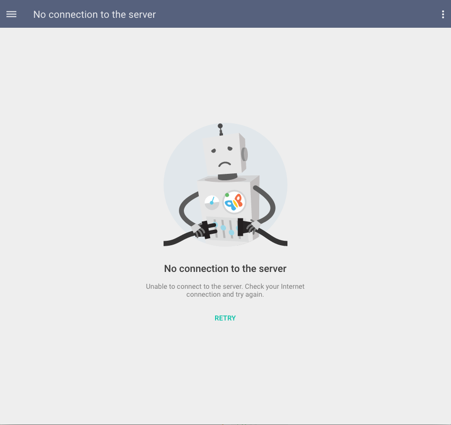
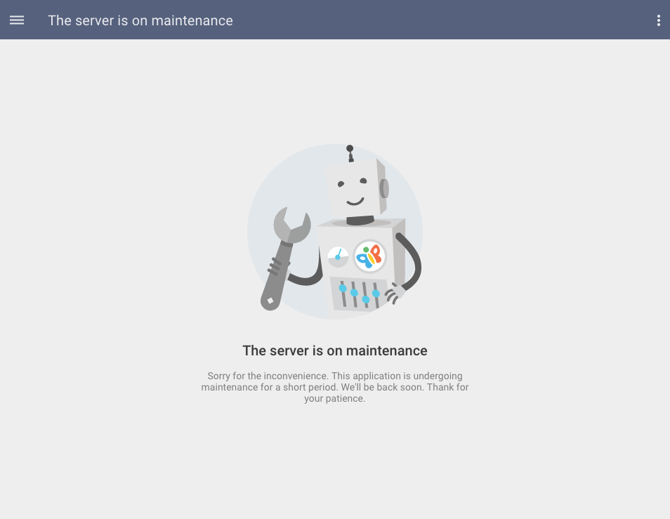
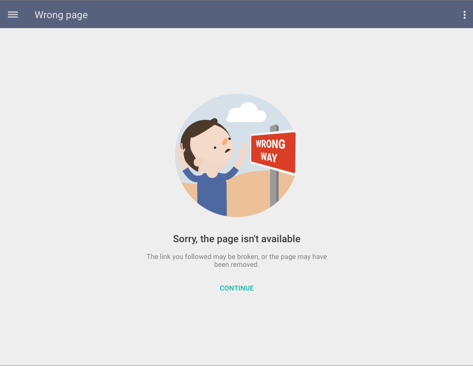
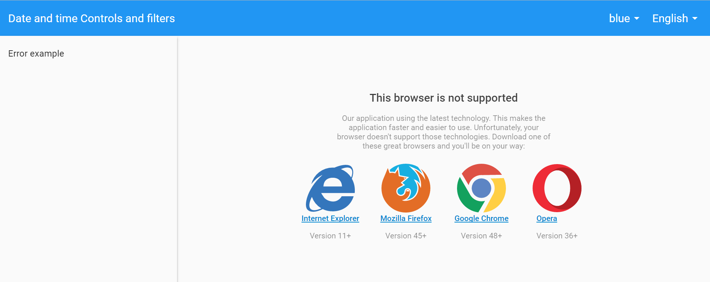
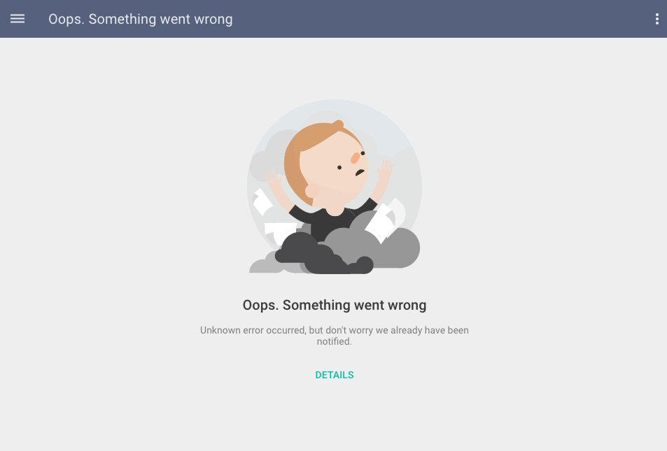

# Pip.WebUI Errors Module

Errors Web UI component is a sub-module for Pip.Services platform and can be used in applications
based on the platform.

This module provides next functionality:

* All-sufficient and styled **Errors** UI component

This module covers some widespread errors are happened on a client side (Like 'No connetion', 'Maintenance error',
'route fails' etc). All states are satisfied with responsive design.

The component is already has predefined states for handy work with implemented errors pages. Thus, the reserved state names:
 * errors_no_connection
 * errors_maintenance
 * errors_missing_route
 * errors_unsupported
 * errors_unknown

All implemented pages are cooperates with `pipAppBar` [component](http://link-to-pipAppBar.com)

In the version 1.0.0 the implementation was cleaned up and covered with unit tests.
Implementation became fully portable across browser and devices.


### The complete library

 * https://github.com/pip-webui/pip-webui

## Demos

[Examples Online](http://webui.pipdevs.com/pip-webui-errors/index.html)


## Quick links

* [Module dependencies](#dependencies)
* [Components](#components)
  - ['Errors pages' service](#help-page-component)
  - ['No Connection' page](#no_connection)
  - ['Maintenance Error' page](#maintenance_error)
  - ['Route Fails' page](#route_fails)
  - ['Unsupported Error' page](#unsupported_error)
  - ['Unknown Error' page](#unknown_error)
* [Browsers compatibility](#compatibility)
* [Community](#community)
* [Contributing](#contributing)
* [Build](#build)
* [License](#license)


## <a name="dependencies"></a>Module dependencies

* <a href="https://github.com/pip-webui/pip-webui-tasks">pip-webui-tasks</a> - Helpful tasks for development
* <a href="https://github.com/pip-webui/pip-webui-lib">pip-webui-lib</a> - Vendor libraries
* <a href="https://github.com/pip-webui/pip-webui-css">pip-webui-css</a> - CSS Framework
* <a href="https://github.com/pip-webui/pip-webui-core">pip-webui-core</a> - Core platform module
* <a href="https://github.com/pip-webui/pip-webui-rest">pip-webui-rest</a> - REST API module
* <a href="https://github.com/pip-webui/pip-webui-controls">pip-webui-controls</a> - Assets of control components
* <a href="https://github.com/pip-webui/pip-webui-layouts">pip-webui-layouts</a> - Document layouts
* <a href="https://github.com/pip-webui/pip-webui-nav">pip-webui-nav</a> - All-sufficient UI navigation components
* <a href="https://github.com/pip-webui/pip-webui-locations">pip-webui-locations</a> - UI components to define and show users location
* <a href="https://github.com/pip-webui/pip-webui-pictures">pip-webui-pictures</a> - UI picture components
* <a href="https://github.com/pip-webui/pip-webui-entry">pip-webui-entry</a> - All-sufficient UI component for any authenticate states
* <a href="https://github.com/pip-webui/pip-webui-test">pip-webui-test</a> - Provides mocked data needed for unit testing


## <a name="components"></a>Module components

### <a name="no_connection"></a>'No Connection' page
<a href="doc/images/img-no_connection.png" style="border: 3px ridge #c8d2df; width: 50%; margin: auto; display: block">
    
</a>

This page is recommended to use when connection between client and server is absent. This component is not required
authentication. This one provides a page and directive for perform the error.This directive accepts callbacks on `'pipRetry'`
and `'pip-error'` message as attributes on `'pipNoConnectionPanel'` directive.
This component includes `pipAppBar` component.

'No Connection' component [API reference](http://link.com)

[Online Example](http://webui.pipdevs.com/pip-webui-errors/index.html#/errors/no_connection)

<br/>

### <a name="maintenance_error"></a>'Maintenance Error' page
<a href="doc/images/img-maintenance.png" style="border: 3px ridge #c8d2df; width: 50%; margin: auto; display: block">
    
</a>

This page is recommended to use when server is not available. This one is not required authentication.

'Maintenance Error' page [API reference](http://link.com)

[Online Example](http://webui.pipdevs.com/pip-webui-errors/index.html#/errors/maintenance)

<br/>

### <a name="route_fails"></a>'Route Fails' page
<a href="doc/images/img-route_fails.png" style="border: 3px ridge #c8d2df; width: 50%; margin: auto; display: block">
    
</a>

This page is recommended to use when user try to open non-existent page(state). It is also does not required user's
authentication.

'Route Fails' page [API reference](http://link.com)

[Online Example](http://webui.pipdevs.com/pip-webui-errors/index.html#/errors/missing_route)

<br/>

### <a name="unsupported_error"></a>'Unsupported Error' page
<a href="doc/images/img-unsupported.png" style="border: 3px ridge #c8d2df; width: 50%; margin: auto; display: block">
    
</a>

This page is recommended to use when user uses non compatible browser and this one notifies user about this.

'Unsupported Error' page [API reference](http://link.com)

[Online Example](http://webui.pipdevs.com/pip-webui-errors/index.html#/errors/unsupported)

<br/>

### <a name="unknown_error"></a>'Unknown Error' page
<a href="doc/images/img-unknown_error.png" style="border: 3px ridge #c8d2df; width: 50%; margin: auto; display: block">
    
</a>

This page uses to notify user about some unexpected error but calm user's that app is not crashed.

'Route Fails' page [API reference](http://link.com)

[Online Example](http://webui.pipdevs.com/pip-webui-errors/index.html#/errors/missing_route)


## <a name="compatibility"></a>Compatibility

PIP.WEBUI has been thoroughly tested against all major browsers and supports:

 * IE11+,
 * Edge
 * Chrome 47+,
 * Firefox 43
 * Opera 35

## <a name="community"></a>Community

* Follow [@pip.webui on Twitter](http://link.com)
* Subscribe to the [PIP.WebUI Newsletter](http://link.com)
* Have a question that's not a feature request or bug report? Discuss on the [PIP Forum](https://groups.google.com/forum/#!forum/pipdevs)
* Have a feature request or find a bug? [Submit an issue](http://link.com)
* Join our Community Slack Group! [PIP Worldwide](http://link.com)


## <a name="contributing"></a>Contributing

Developers interested in contributing should read the following guidelines:

* [Issue Guidelines](http://somelink.com)
* [Contributing Guidelines](http://somelink.com)
* [Coding guidelines](http://somelink.com)

> Please do **not** ask general questions in an issue. Issues are only to report bugs, request
  enhancements, or request new features. For general questions and discussions, use the
  [Pip Devs Forum](https://groups.google.com/forum/#!forum/pipdevs).

It is important to note that for each release, the [ChangeLog](CHANGELOG.md) is a resource that will
itemize all:

- Bug Fixes
- New Features
- Breaking Changes

## <a name="build"></a>Build

Projects environment deploy is occurred using npm and gulp.

First install or update your local project's **npm** tools:

```bash
# First install all the NPM tools:
npm install

# Or update
npm update
```

Then run the **gulp** tasks:

```bash
# To clean '/build' and '/dist' directories
gulp clean

# To build distribution files in the `/dist` directory
gulp build

# To launch samples (build will open samples/index page in web browser)
gulp launch
```

For more details on how the build process works and additional commands (available for testing and
debugging) developers should read the [Build Instructions](docs/guides/BUILD.md).


## <a name="license"></a>License

PIP.WebUI is under [MIT licensed](LICENSE).

