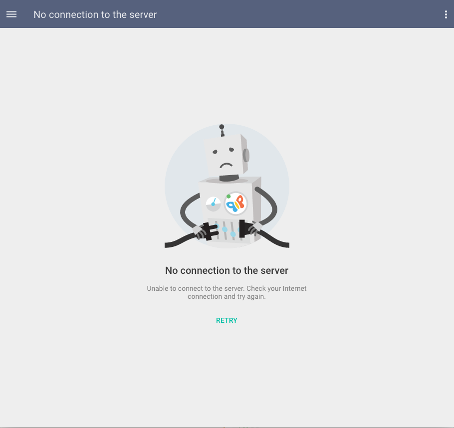

# Pip.WebUI.Errors User's Guide

## <a name="contents"></a> Contents
- [Installing](#install)
- [No connection page](#no_connection_page)
- [pipNoConnectionPanel](#no_connection panel)
- [Server maintenance page](#server_maintenance_page)
- [Unsupported browser page](#unsupported_browser_page)
- [Unknown error page](#unknown_error_page)
- [pip-error-panel component](#error_panel)
- [Questions and bugs](#issues)


## <a name="install"></a> Installing

Add dependency to **pip-webui** into your **bower.json** or **package.json** file depending what you use.
```javascript
"dependencies": {
  ...
  "pip-webui": "*"
  ...
}
```

Alternatively you can install **pip-webui** manually using **bower**:
```bash
bower install pip-webui
```

or install it using **npm**:
```bash
npm install pip-webui
```

Include **pip-webui** files into your web application.
```html
<link rel="stylesheet" href=".../pip-webui-lib.min.css"/>
<link rel="stylesheet" href=".../pip-webui.min.css"/>
...
<script src=".../pip-webui-lib.min.js"></script>
<script src=".../pip-webui.min.js"></script>
```

Register **pipErrorHandling** module in angular module dependencies.
```javascript
angular.module('myApp',[..., 'pipErrorHandling']);
```


## <a name="no_connection_page"></a> No connection page

**No connection** error page is presented when call to REST API fails after timeout or when network status entirely goes down.
The user has option to retry the last operation.

Navigation to this page can be done using **errors_no_connection** state or **/#errors/no_connection** route.

### Usage
```javascript
var params = {
        error: error,
        unfoundState: {
            to: 'unfound',
            toParams: {}
        },
        fromState: {
            to: 'about_me',
            fromParams: {}
        }};
$state.go('errors_unknown', params);
```




## <a name="no_connection_panel"></a> pipNoConnectionPanel

In some situations connection can be lost inside forms while user is trying to save his work or perform operaton that calls the server. Switching to **No connection** page in that case may cause distruptions and lost work. Instead, it is recommended to
show 'No connection' panel directly on the form and allow user to retry his attempt when connection comes back.

### Usage
```html
<pip-no-connection-panel pip-error="error"
                         pip-retry="updateFunction">
</pip-no-connection-panel>
```

Todo: Add screenshot with no connection panel

### Attributes
* **pip-error** - error object
* **pip-retry** - retry function

## <a name="server_maintenance_page"></a> Server maintenance page

**Server maintenance** error page is presented when REST API received 503 (Not available) status code from the server.
It means that server is down for maintenance. After that user shall close the application and come back after some time.

Navigation to this page can be done using **errors_maintenance** state or **/#errors/maintenance** route.

### Usage
```javascript
var params = {
        error: error,
        unfoundState: {
            to: 'unfound',
            toParams: {}
        },
        fromState: {
            to: 'about_me',
            fromParams: {}
        }};
$state.go('errors_maintenance', params);
```


## <a name="missing_route_page"></a> Missing route page

**Missing route** error page is presented when user tries to open route that is not recognized by the application. 
It may happen when user tries to open obsolete link or makes a mistake while entering page url manually.

Navigation to this page can be done using **errors_missing_route** state or **/#errors/missing_route** route.

### Usage
```javascript
var params = {
        error: error,
        unfoundState: {
            to: 'unfound',
            toParams: {}
        },
        fromState: {
            to: 'about_me',
            fromParams: {}
        }};
$state.go('errors_missing_route', params);
```


## <a name="unsupported_browser_page"></a> Unsupported browser page

Pip.WebUI framework uses the latest HTML5 technologies and doesn't support older browsers. While that is a rare case,
some users may try to open application using something archaic. In that case he will be presented with 
**Unsupported browser** error page thats user to try a newer version of the browser. 

Navigation to this page can be done using **errors_unsupported** state or **/#errors/unsupported** route.

### Usage
```javascript
var params = {
        error: error,
        unfoundState: {
            to: 'unfound',
            toParams: {}
        },
        fromState: {
            to: 'about_me',
            fromParams: {}
        }};
$state.go('errors_unsupported', params);
```


## <a name="unknown_error_page"></a> Unknown error page

This is a default error page and is show in bad situations, other then listed above.

Navigation to this page can be done using **errors_unknown** state or **/#errors/unknown** route.

### Usage
```javascript
var params = {
        error: error,
        unfoundState: {
            to: 'unfound',
            toParams: {}
        },
        fromState: {
            to: 'about_me',
            fromParams: {}
        }};
$state.go('errors_unknown', params);
```


## <a name="error_panel"></a> pip-error-panel components

**pip-error-panel** shows an error embedded into a page.

### Usage
```html
 <div class="pip-page-errors">
        <span class="pip-error-text">Roboto Regular 14px Error Color.Background - rgba (0, 0, 0, 0.08) </span>
        <a class="pip-error-details">
            <md-icon md-svg-icon="icons:warn-circle"></md-icon>
            <span class="flex"> DETAILS  </span>
        </a>
    </div>
```


### CSS Classes
* **pip-error-text** - text error
* **pip-error-details** - class for div with details information


## <a name="issues"></a> Questions and bugs

If you have any questions regarding the module, you can ask them using our 
[discussion forum](https://groups.google.com/forum/#!forum/pip-webui).

Bugs related to this module can be reported using [github issues](https://github.com/pip-webui/pip-webui-errors/issues).
